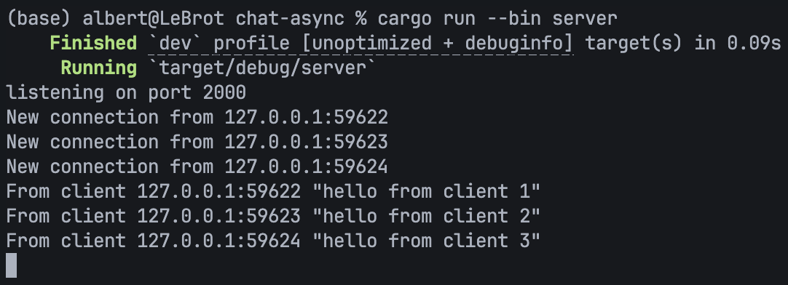
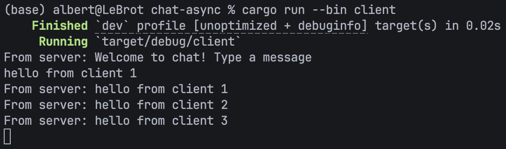
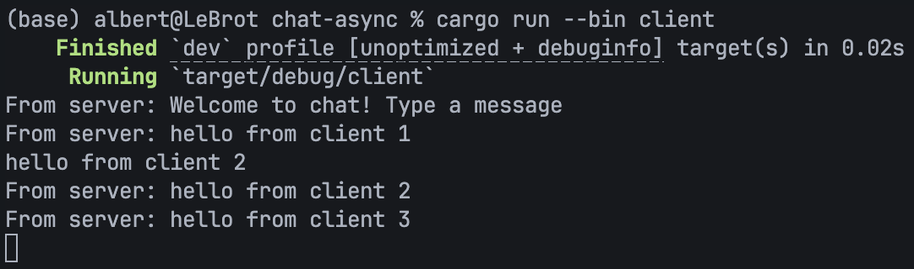
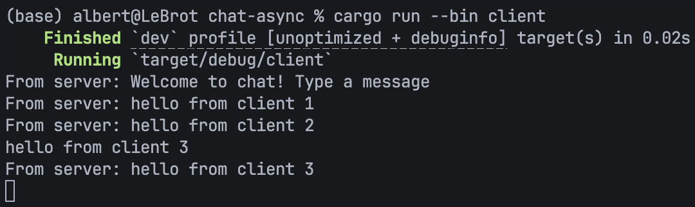
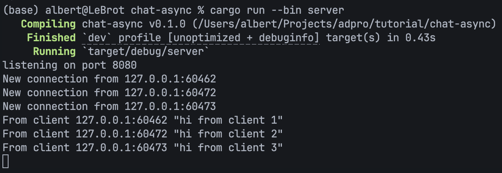
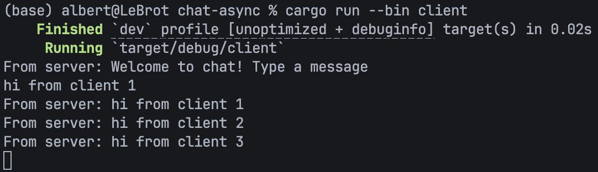
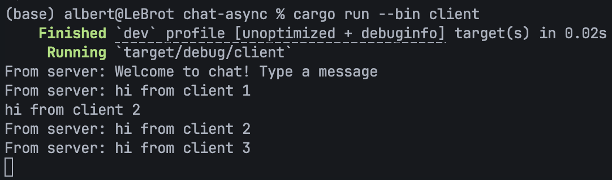
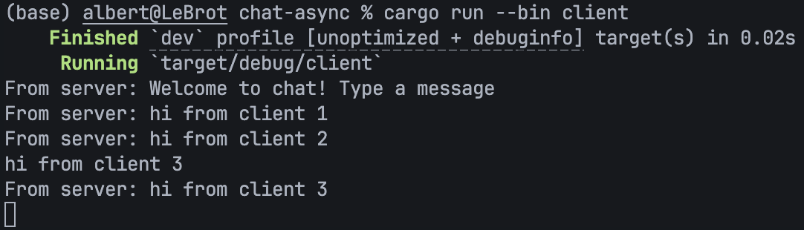

# Module 10 Tutorial - Asynchronous Programming

Julius Albert Wirayuda  
2406425792

## How to Run

1. **Start the Server**:
   Open a terminal window and run the following command to start the broadcast chat server:

   ```bash
   cargo run --bin server
   ```

2. **Start the Clients**:
   Open multiple separate terminals (e.g., three separate tabs) and run the client binary in each of them:

   ```bash
   cargo run --bin client
   ```

## 2.1. Original Code of Broadcast Chat

### System Behavior & Flow

When a client types some text in their terminal and presses **Enter**:

1. **Client Sends Message**: The client reads the input line from standard input (`stdin`) in [src/bin/client.rs](./src/bin/client.rs) and asynchronously sends it to the server over the WebSocket connection (`ws_stream.send`).

2. **Server Receives Message**: The server receives the text message from the client's socket within the connection handler loop in [src/bin/server.rs](./src/bin/server.rs). It prints a log to the server console (e.g., `From client 127.0.0.1:65123 "Hello!"`).

3. **Server Broadcasts**: The server sends the received text into a Tokio broadcast channel (`bcast_tx.send(text)`), which acts as a pub/sub event bus.

4. **All Clients Receive Message**: Every active connection's handler loop is listening to this broadcast channel (`bcast_rx.recv()`). When a new message is broadcast, the server retrieves it and sends it back to each client's individual WebSocket stream.

5. **Clients Print Message**: Finally, all connected clients receive the message and print it to their console (e.g., `From server: Hello!`).

### Server



### Client 1



### Client 2



### Client 3



## 2.2. Modyfing the Websocket Port

To modify the connection port to `8080`, changes are required on both sides of the connection: the server side and the client side. On the server side, in [src/bin/server.rs](./src/bin/server.rs), the [TcpListener](./src/bin/server.rs#L5) is modified to bind to `"127.0.0.1:8080"`. On the client side, in [src/bin/client.rs](./src/bin/client.rs), the [ClientBuilder](./src/bin/client.rs#L5) is modified to connect to `"ws://127.0.0.1:8080"`.

Both the server and client are using the same WebSocket protocol. The protocol is initiated on the client side using the `"ws://"` URI scheme, and on the server side, the raw TCP stream accepted from [TcpListener](./src/bin/server.rs#L5) is upgraded to a WebSocket connection using [ServerBuilder](./src/bin/server.rs#L7). This protocol standard is defined and implemented by the `tokio-websockets` library specified in the project's [Cargo.toml](./Cargo.toml).

### Server



### Client 1



### Client 2



### Client 3


